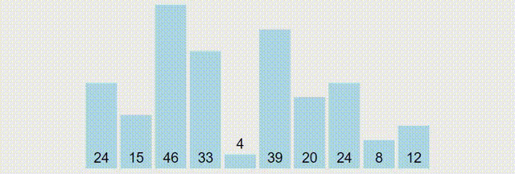
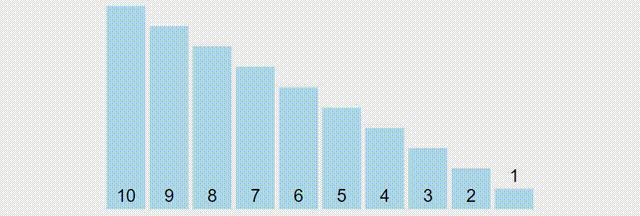
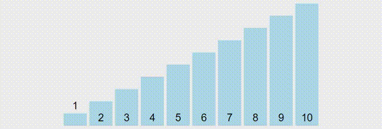

# Bubble Sort

``` cpp
for i = N - 1 to 1
  swapped = false
  for j = 0 to (i - 1)
    if a[j] > a[j + 1]
      swap(a[j], a[j + 1])
      swapped = true
  if swapped == false
    break
```


> a[j] and a[j + 1] are 2 green bars



Reversed Sorted - Worst Case - `O(n^2)`



Sorted - Best Case - `O(n)`

