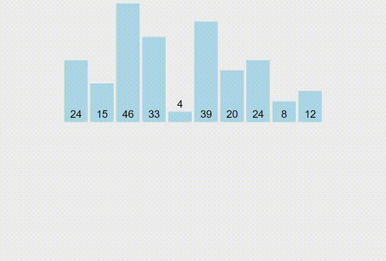
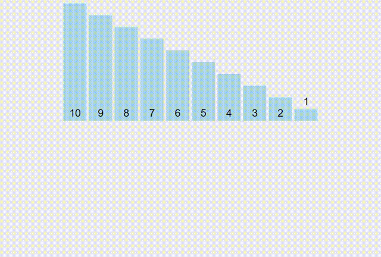
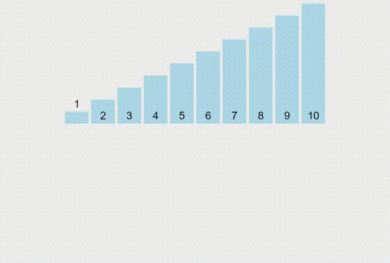

# Insertion Sort

``` cpp
for i = 1 to (N-1)
  key = a[i]
  j = i - 1
  while (j >= 0 and key < a[j])
    a[j + 1] = a[j]
    j--
  a[j + 1] = key
```

Complexity: `O(n^2)`

```
key = red bar
a[j] = green bar
a[j+1] = the gap
```



Reversed Sorted - Worst Case - `O(n^2)`



Sorted - Best Case - `O(n)`

