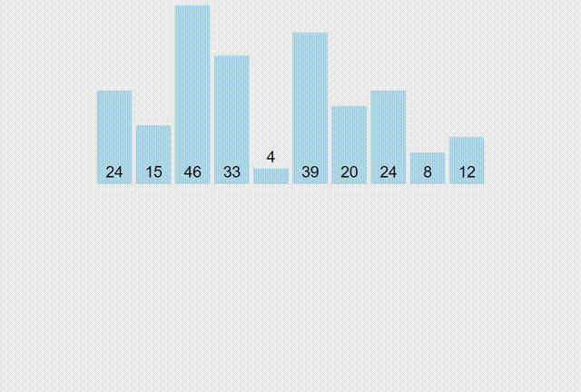
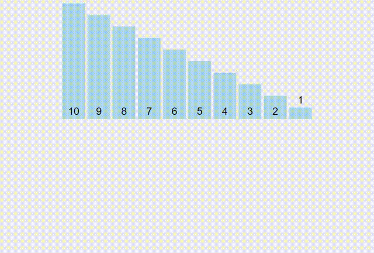
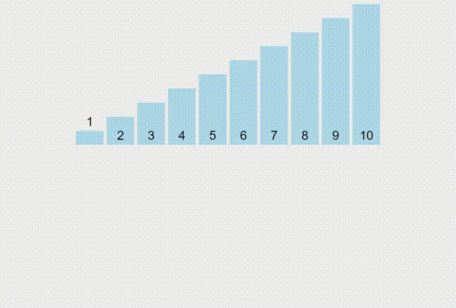

# Merge Sort

```
void merge(int arr[], int left, int mid, int right) {
  // Create 2 sub-arrays
  int n1 = mid - left + 1;
  int n2 = right - mid;
  int* L = new int[n1];
  int* M = new int[n2];
  for (int i = 0; i < n1; i++)
    L[i] = arr[left + i];
  for (int j = 0; j < n2; j++)
    M[j] = arr[mid + 1 + j];

  // Maintain current index of sub-arrays and main array
  int i, j, k;
  i = 0;
  j = 0;
  k = left;

  // Until we reach either end of either L or M, pick larger among elements L and M
  while (i < n1 && j < n2) {
    if (L[i] <= M[j]) {
      arr[k] = L[i];
      i++;
    } else {
      arr[k] = M[j];
      j++;
    }
    k++;
  }

  // When we run out of elements in either L or M, pick up the remaining elements
  while (i < n1) {
    arr[k] = L[i];
    i++;
    k++;
  }
  while (j < n2) {
    arr[k] = M[j];
    j++;
    k++;
  }

  delete[] L;
  delete[] M;
}

void mergeSort(int arr[], int left, int right) {
  if (left < right) {
    int mid = left + (right - left) / 2;
    mergeSort(arr, left, mid);
    mergeSort(arr, mid + 1, right);
    merge(arr, left, mid, right);
  }
}
```

Complexity: `O(n*logn)`



Reversed Sorted



Sorted

