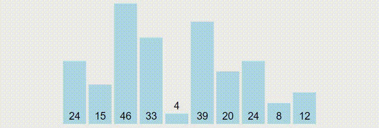
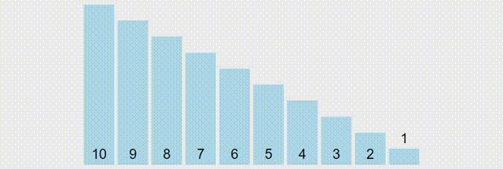
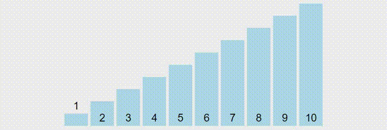

# Quick Sort

```
int partition(int array[], int left, int right) {
  // Select the pivot element
  int pivot = array[right];
  int i = (left - 1);

  // Put the elements smaller than pivot on the left 
  // and greater than pivot on the right of pivot
  for (int j = left; j < right; j++) {
    if (array[j] <= pivot) {
      i++;
      swap(&array[i], &array[j]);
    }
  }
  swap(&array[i + 1], &array[right]);
  return (i + 1);
}

void quickSort(int array[], int left, int right) {
  if (left < right) {
    // Select pivot position and put all the elements smaller 
    // than pivot on left and greater than pivot on right
    int pi = partition(array, left, right);

    quickSort(array, left, pi - 1);
    quickSort(array, pi + 1, right);
  }
}
```

Complexity: `O(n^2)`



Reversed Sorted



Sorted

