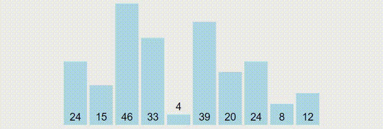
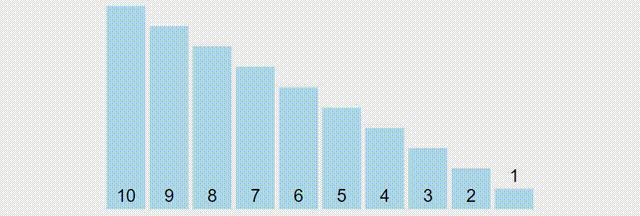
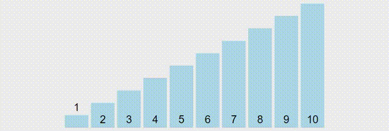

# Selection Sort

```
for i = 0 to (N - 2)
  minimum = a[i]
  for j = i + 1 to (N - 1)
    if a[j] < minimum
      minimum = a[j]
  swap(minimum, a[i])
```

Number of comparisons: `(n - 1) + (n - 2) + (n - 3) +.....+ 1 = n(n - 1) / 2`

Complexity: `O(n^2)`

```
a[i] = first unsorted element
minimum = red bar
```



Reversed Sorted - Worst Case - `O(n^2)`



Sorted - Best Case - `O(n^2)`

