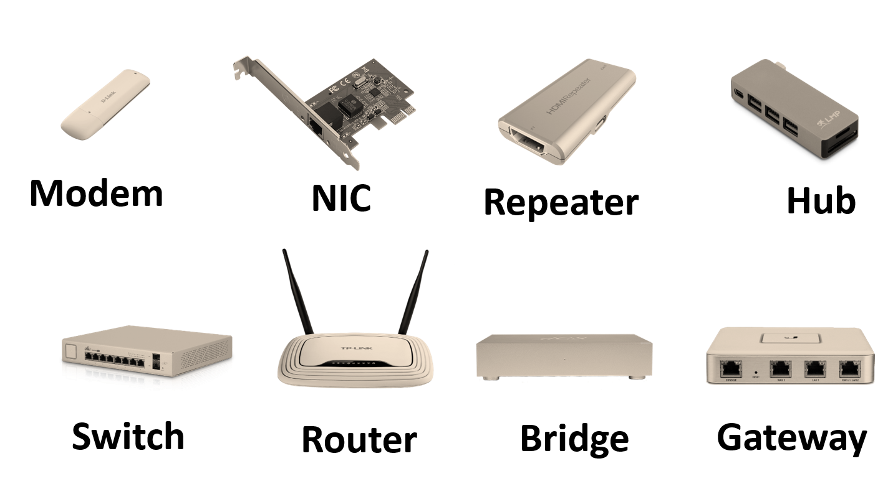
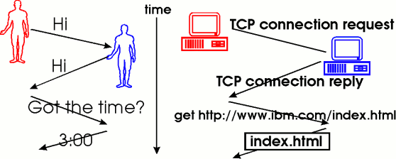
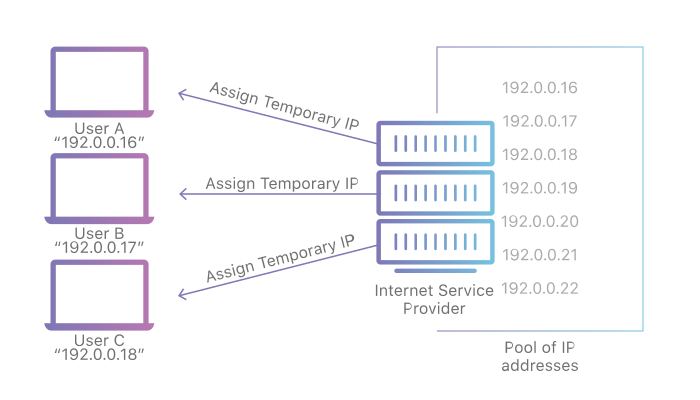
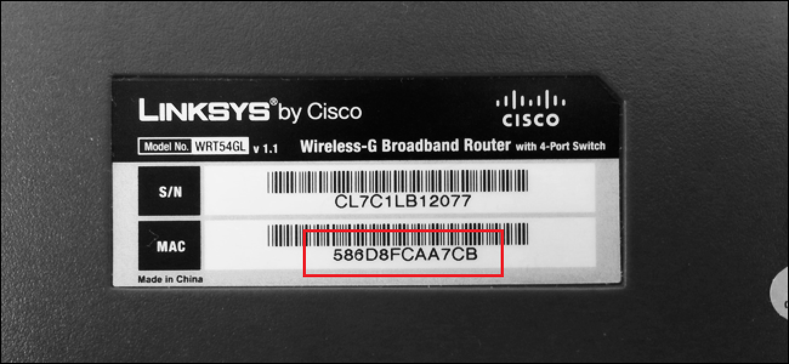
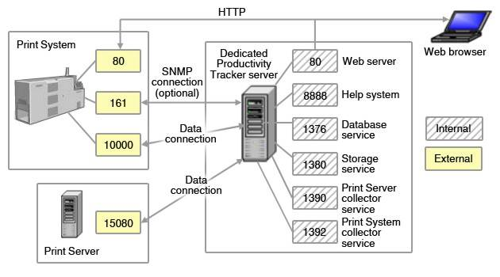

# Computer Networking

### Computer Network
An interconnection of multiple devices, also known as hosts, that are connected using multiple paths for the purpose of sending/receiving data or media. 

Computer networks can also include multiple devices which help in the communication between two different devices; these are known as Network devices and include things such as routers, switches, hubs, and bridges.



### Network Topology
The layout arrangement of the different devices in a network. Common examples include: Bus, Star, Mesh, Ring, and Daisy chain, etc.


### Open system
A system which is connected to the network and is ready for communication.

### OSI
OSI stands for Open Systems Interconnection. It is a reference model that specifies standards for communications protocols and also the functionalities of each layer.


### Protocol
A protocol is the set of rules or algorithms which define the way how 2 entities can communicate across the network.

There exists different protocol defined at each layer of the OSI model. Few of such protocols are TCP, IP, UDP, ARP, DHCP, FTP and so on.



## Unique Identifiers Of Network

### Host name
Each device in the network is associated with a unique device name known as Hostname.

To displays the hostname of your machine, type `hostname` in the cmd
```
hostname
```

### IP Address (Internet Protocol address - Logical Address)
The IP Address is the network address of the system across the network.

To identify each device in the world-wide-web, the IANA (Internet Assigned Numbers Authority) assigns an IPV4 address as a unique identifier to each device on the Internet.

The length of an IPv4 address is 32-bits, hence, we have 2^32 IP addresses available. The length of an IPv6 address is 128-bits.



### MAC Address (Media Access Control address - Physical Address)
The MAC Address is the unique identifier of each host and is associated with its NIC (Network Interface Card).

A MAC address is assigned to the NIC at the time of manufacturing.

The length of the MAC address is : 12-nibble/ 6 bytes/ 48 bits.



To know the IP address, MAC address of the device, type `ipconfig/all` in the cmd
```
ipconfig/all
```

### Port (Logical port)
A port can be referred to as a logical channel through which data can be sent/received to an application.

Any host may have multiple applications running, and each of these applications is identified using the port number on which they are running.

A port number is a 16-bit integer, hence, we have 2^16 ports available which are categorized as shown below:

Number of ports: 65536 (2^16)

Range: 0 – 65535 

Port Types       | Range
---------------- | ----------------
Well known Ports | 0 – 1023
Registered Ports | 1024 – 49151
Ephemeral Ports  | 49152 – 65535



To list all the port being used, type `netstat -a` in the cmd
```
netstat -a
```

### Socket

Socket is the unique combination of IP address and Port number.

## Other related concepts

### DNS
DNS stands for Domain Name system. 

DNS is basically a server which translates web addresses or URLs (ex: www.google.com) into their corresponding IP addresses.

TO know the IP address of one domain and the information of the DNS server, type `nslookup` in the cmd
```
nslookup
```


### ARP
ARP stands for Address Resolution Protocol.

It is used to convert an IP address to its corresponding physical address(i.e., MAC Address).

ARP is used by the Data Link Layer to identify the MAC address of the Receiver’s machine.

### RARP
RARP stands for Reverse Address Resolution Protocol.

As the name suggests, it provides the IP address of the device given a physical address as input. But RARP has become obsolete since the time DHCP has come into the picture. 