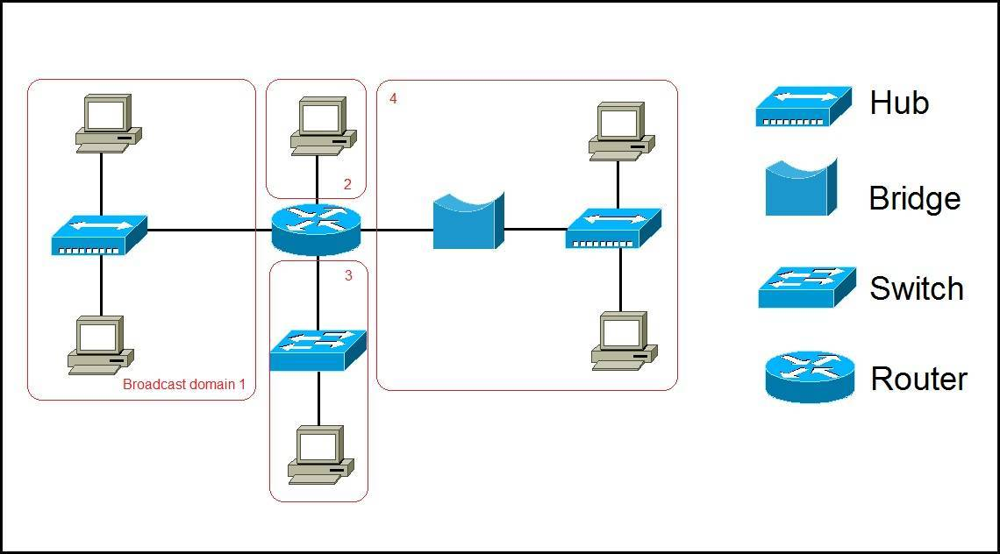
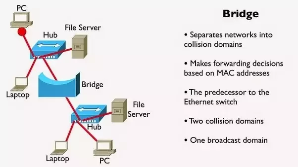
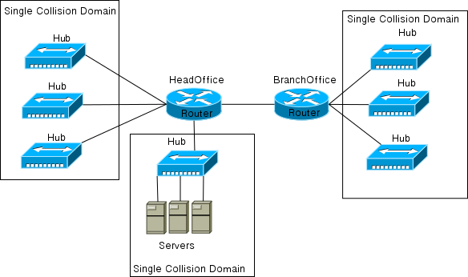
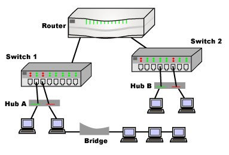

# Network Devices

### Repeater
- Layer: 1 - Physical Layer
- Repeaters regenerate the signal over the same network before the signal becomes too weak or corrupted so as to extend the length to which the signal can be transmitted over the same network.
- An important point to be noted about repeaters is that they do not amplify the signal. When the signal becomes weak, they copy the signal bit by bit and regenerate it at the original strength. It is a 2 port device. 

### Hub (multiport repeater)
- Layer: 1 - Physical Layer
- Hubs connect multiple wires coming from different branches, for example, the connector in star topology which connects different stations.
- Hubs cannot filter data, so data packets are sent to all connected devices.  In other words, collision domain of all hosts connected through Hub remains one.  Also, they do not have intelligence to find out best path for data packets which leads to inefficiencies and wastage.

### Bridge
- Layer: 2 - Data Link Layer
- Bridges are repeaters, with add on the functionality of filtering content by reading the MAC addresses of source and destination. 
- A bridge is also used for interconnecting two LANs working on the same protocol. It has a single input and single output port, thus making it a 2 port device.
  
### Switch (multiport bridge)
- Layer: 2 - Data Link Layer
- A switch is a multiport bridge with a buffer and a design that can boost its efficiency (a large number of ports imply less traffic) and performance. 
- The switch can perform error checking before forwarding data, that makes it very efficient as it does not forward packets that have errors and forward good packets selectively to correct port only.  In other words, switch divides collision domain of hosts, but broadcast domain remains same. 

### Routers
- Layer: 3 - Network Layer
- A router is a device like a switch that routes data packets based on their IP addresses. 
- Routers normally connect LANs and WANs together and have a dynamically updating routing table based on which they make decisions on routing the data packets. Router divide broadcast domains of hosts connected through it.

### Gateway
- Layer: Any
- A gateway, as the name suggests, is a passage to connect two networks together that may work upon different networking models. They basically work as the messenger agents that take data from one system, interpret it, and transfer it to another system. 
- Gateways are also called **protocol converters** and can operate at any network layer. Gateways are generally more complex than switch or router.

### Relationship

