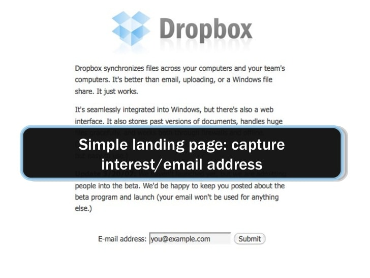
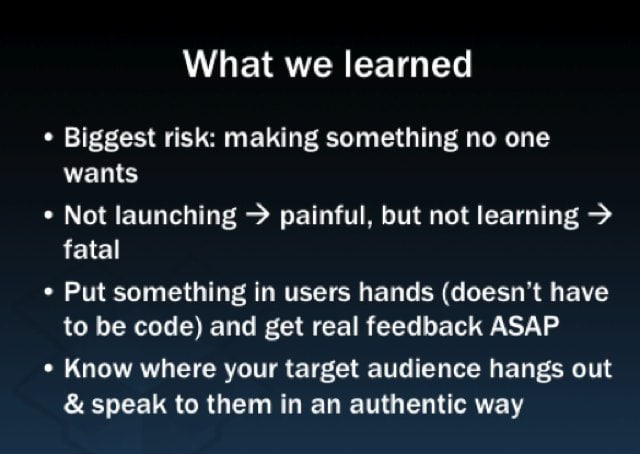

# How do you decide what to build?

*“Design is a process of making dreams come true.”* – The Universal Traveler

In the previous chapter, we talked about the immense importance of researching an audience and intimately understanding them. Now we’re going to look at the first step of turning this data into an actual product.

Let’s begin by talking about Drew Houston. You’ve probably heard of him—he’s the guy who made Dropbox. It’s a product you likely use every day. And it’s generating over $200M of revenue per year.

Houston’s creation of Dropbox has been labeled for years as the quintessential example of the MVP in action. The story goes that Drew couldn’t get funding for his idea of a seamlessly-syncing file service. So he did what any aspiring entrepreneur did in 2008: he made a video and submitted it to the online communities he frequented.

It was an instant hit, driving 70,000 new email subscribers through a simple landing page.

*Dropbox’s original landing page*

But I don’t believe chalking this success up to a hope-and-pray MVP is quite right. Drew didn’t just get lucky. This was the result of somebody who created a product for an audience he knew, did the work to understand that audience, and wove that knowledge into his product and his pitch.

To get his audience’s attention, he riddled the video with inside jokes and references only somebody who spent time in these forums would recognize.

But even more powerfully, he spoke directly to them, in their language, about the problem his product solved:

“The point is that if you’ve ever worked with multiple computers or carried around a USB drive or emailed yourself files from work, you can see that this is a much easier way of managing your stuff.”
“Normally, if I want to send something, I have to send an email attachment or something like that. But Dropbox has this special public folder where every file you put in here has a URL associated with it.”

Luckily for us, the Reddit thread created in response to Drew’s video still lives. The responses are testament to the fact that both the pitch and the product got their attention.

“Apple? You listening? This is how iDisk should work. Your dismal effort is a total embarrassment.”

“So many more references to /b/ and teh interwebz i cant even count them all… :O”

“_My Grandma is the sultan of stubborn! She just images partitions into a file using ‘dd’ and uses ‘strings’ to find things that she wants. Still has to use ‘grep’ though! Crazy lady._”

Remember these quotes. These are the bright, shining signs of truly connecting with an audience.

*A slide from one of Drew’s presentations*

Drew’s takeaways? **The biggest risk of creating a product is 'making something no one wants.** Find customers by knowing “where your target audience hangs out & speak to them in an authentic way.”

## Take your first step into a larger world
To even think about starting the process of defining what product you’re going to build, you need to know your customer. Intimately.

And no, I’m not talking about asking random people at Starbucks or “interviewing” high school students when you’re actually trying to pitch them on your Snapchat clone.

Oops. I meant to say “Snapchat killer.”

**“Leading the witness”** or **trying to stuff a product down the throat of an unsuspecting bystander is a good way to build the wrong thing**.

Instead, you’ll need to observe them where they hang out: forums, workplaces, homes, review sites, support inboxes, Twitter, Facebook groups. What questions do they ask? What haunts them? Who do they wish they could be? What mentalities tend to hold them back? How do they speak? What do they tend to do every day?

What’s their biggest hurt? What would bring them their biggest joy?

Just be like Drew.

Gathering this data takes time, but it’s the foundation on which your product will stand. **Can you afford to build a skyscraper with crumbling cement?**

My guess would be… no.

Once you have tons of data and you’ve analyzed the patterns, organize it into what I call the Pain Matrix: 

Let’s take a look at the 4 quadrants and what they entail:

* **Upper right**: Put frequently-occurring, intense pain here. If a product can alleviate whatever is plaguing your audience in this quadrant, this is where you want to be to bring the most joy to your customers.
* **Lower right**: Infrequent, yet intense pain goes here. Products in this category might be nice-to-haves, surprising your audience if they were properly addressed.
* **Upper left**: place the little pinpricks of pain that occur often amongst your customers. Products in this category might address smaller problems like administrative challenges, things that people label “it is what it is,” and provide a customer “little wins.”
* **Lower left**: here’s where you’ll place the little pains that happen infrequently. This is something that might appear like an opportunity while steeped in the details of your data, but reveals itself to be a low-opportunity product to build when stepping back to look at the bigger picture.

This plot is obviously subjective. But your judgment will improve as your knowledge of the audience grows.

And by creating this, you’ve just created the perfect piece of collateral for a product meeting to hash out what you’re building. This document becomes a communication device, an advocate for your customers. Everybody can see it and you can back it up with your data. Bonus points for direct quotes.

But don’t be satisfied with using the Pain Matrix as simply a discussion piece. Everybody who’s got a hand in the what-are-we-building cookie jar needs to study this document and the primary customer research you’ve done.

## Who gets invited to the party?
Everybody loves to be in product meetings. Especially when you’re deciding what to build.

Treat this process like you’re the bouncer at a biker bar (hint: not everybody gets in).

**Defining the product you’re going to build first starts with who’s defining it.** In other words, who’s in the room together? How much do they know about the pains you’ve found? And how do you frame the discussion?

This obviously depends on the product you’re building, the size of your team, and the stage of your company. But it tends to be true that **everyone who’s going to be involved in the creation of the product should be at the first meeting**. An example of this could include:

* The designer who will be working on the project (this might be you)
* The engineer(s) with whom you’ll be working to build the product (typically front-end and back-end)
* A representative from the team who will be launching and promoting the product (this could be someone from marketing or public relations)

You should really try and follow Amazon’s 2 - Pizza Rule here: **if the number of people on a team can’t be fed by 2 pizzas, then it’s too big**. In actuality, that probably caps this team at or around 5 people. Beyond that, larger teams get overconfident, communicate worse, and take longer to get stuff done.

## Party like it's 1991
Regis McKenna had something to say about this process. When he saw how fast technology was changing society in 1991, he realized—like our friend Neil McElroy at Procter & Gamble—that a new role would need to be formalized. This person would be “an integrator, both internally—synthesizing technological capability with market needs—and externally—bringing the customer into the company as a participant in the development and adaptation of goods and services.”

If your eyes glazed over reading that, well, you should read it again. Because McKenna was responsible for launching some of the hallmarks of the computer age: the first microprocessor at Intel, Apple’s first PC, and The Byte Shop, the world’s first retail computer store. Oh, and 1 more thing: he was the guy behind the “startup in a garage” legend first made famous by Apple.

Did you read it again? Something sounds familiar.

Hey, he’s describing you!

You’re the product designer. **The integrator. You’re the customer’s champion, their expert, their advocate.**

This process requires you to lead your team through the research and to propose product ideas to eliminate your customer’s pain or find their joy effectively.

Take the opportunity as an “integrator” to build on your strengths as a team: what innovative technologies and design can you apply to the problem at hand? Even better, what can you and your team uniquely build for this audience?

I think Josh Elman (Greylock, Zazzle, LinkedIn, Facebook, Twitter) has great insight on this part of the product creation process. This is from an interview I conducted for my upcoming book from O’Reilly, How Product Designers Work:

“The first thing is you have to trust your team. I think that sounds obvious, but it’s much harder in practice. I think a lot of structures and processes are built on the fact that there isn’t innate trust….next, get your team’s help in how to solve the problem. The team knows what they can build. The team knows how it can be developed. The designers know what kinds of things are designable and natural in the product and what kinds of things are not. All of this matters.”

Look at the Pain Matrix. What are the observations you made that fit into the upper-right quadrant? How can you build your customers’ dream product?

To reiterate: **you can never lose sight of the actual, observed, tangible pains and joys that you’ve researched**. Resist the temptation to delve into hopes and dreams. Just throwing an “MVP” out into the wild to “validate” something you spend time building is a waste of time, money, and talent.

You’re better than that.

## Keeping everybody focused
There’s always a big problem when the club-like euphoria from a product meeting starts to turn focus into chaos. How do you keep everybody on task and debating healthily?

I highly recommend a whiteboard for idea collection and harvesting. This serves 3 practical purposes:

1. It’s difficult to remember what was said. You don’t want good ideas getting lost simply because there were too many thrown around the room.
2. It allows you to be visual. Not all ideas can be verbally explained. A low-fidelity medium allows anybody to sketch the central core of the idea without unnecessary detail.
3. Over time, the group forgets whose idea was what. This naturally allows the best ideas to float to the top and the worst ones to sink to the bottom. This is hugely beneficial especially with an influx of new ideas. With new ideas come the risk of hurt egos and the so-called not invented here syndrome. Called the Cauldron, it was a process used by Apple—sometimes even with Steve Jobs in the room—and has been adopted by companies like KISSmetrics. The Cauldron “let us make a great soup, a great potion, without worrying about who had what idea. This was critically important, in retrospect, to decouple the CEO from the ideas. If an idea was good, we’d all eventually agree on it, and if it was bad, it just kind of sank to the bottom of the pot. We didn’t really remember whose ideas were which—it just didn’t matter.”

A technique used at Medium involves a timer set at 2 minutes. With a group of people in a room, the problem will be defined and “you have 2 minutes to write down as many ideas as possible. Then you have 5 minutes to put the ideas on a whiteboard and explain them. Then you have another 2 minutes to add to ideas,” Jason Stirman said in an interview I conducted.

## Key takeaways
When this meeting is done, you’ll want to leave with some hard, real paper.

I love Cap Watkins’ approach. The Vice President of Design at Buzzfeed and former Etsy Senior Design Manager keeps his team on task after the meeting by creating what he calls an internal product guide:

“At the end of the meeting, leave with:

* What you’re doing
* Why you’re doing it (problems you’re trying to solve)
* What success looks like (quantitatively and qualitatively)”

This document helps you “keep yourself and your team focused and prevent design creep: if it doesn’t solve the problem or meet the goals, it doesn’t go into this version.”

The only 2 elements missing from this approach are who's responsible for what pieces of the product, and when they'll be done.  

Take Apple’s advice on this one. Pre-dating 1997 Steve Jobs, the company follows this rule for every project they undertake: the Directly Responsible Individual (DRI). It's a simple, yet effective rule. By placing one’s name next to a task-to-be-completed in front of the entire company, you can be sure that individual feels more responsibility to perform.

In your own internal product guide, use this rule and make sure that every line item has a DRI. Assign someone (or recruit volunteers) to complete each task. Make sure this is in place before you break up the meeting. Include it in your guide’s circulation.

It's not enough to put people’s names next to line items. You and your team need dates, too. Do you need to do research for technological or data considerations? Do you need to build a prototype for a very specific idea? Did you misinterpret something in your audience analysis? By giving every task a deadline, you'll maintain momentum even when the initial enthusiasm of creating something new dies down.

## New features and new products need apply
This process continues, over and over, for both new products and their features. Be the integrator. Be the leader. **Be the customer’s advocate. Don’t settle for hand-waving and bravado.**

You’re better than that. More talented.

And probably better looking.

## Action items
* Re-examine the knowledge your team has of your audience. Encourage them to study up on the research you’ve done so they can make more informed product decisions. 
* Think about how your product can really make your customers happy. Are you really bringing them joy? Are you truly able to alleviate their pains and satiate their needs?
* Take stock of how your team conducts meetings and makes decisions. See if any of the techniques mentioned in this email can help you make more realistic decisions in a smaller time period.