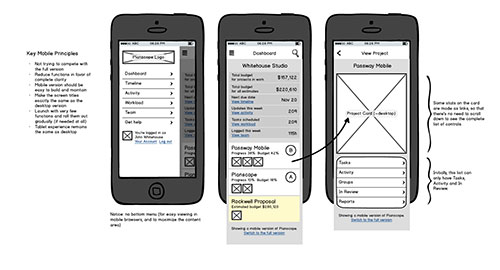
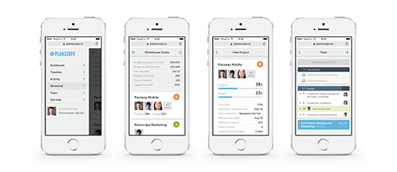

# What is UI design?

## Introduction

Let's start by defining the terms “user interface” and “user interface design.”

Originally, the term “user interface” applied to all kinds of human-machine interaction. As much as computers and mobile devices have developed throughout the years, today this term primarily means “graphical user interface” (GUI).

Graphical user interface provides a comfortable way to interact with electronic devices through icons, buttons, and other graphic elements (as opposed to text-based console interfaces, which are much harder to use).

Today we take splendid software interfaces for granted, rant about minor bugs, and forget that many years ago it was a life-changing improvement. We all should be grateful—we don't have to stare at hostile black screens trying to remember sophisticated text commands.

“**User interface design (UID)** or **user interface engineering** is the design of user interfaces for machines and software, such as computers, home appliances, mobile devices, and other electronic devices, with the focus on maximizing the user experience. The goal of user interface design is to make the user's interaction as simple and efficient as possible, in terms of accomplishing user goals (user-centered design). Interface design is involved in a wide range of projects from computer systems, to cars, to commercial planes; all of these projects involve much of the same basic human interactions yet also require some unique skills and knowledge. As a result, designers tend to specialize in certain types of projects and have skills centered on their expertise, whether that be software design, user research, web design, or industrial design.” – Wikipedia

Most of us have never designed a machine interface—we work in the software industry. So let's take our clarification further and give a modern definition of UI design that relates to our scheme of things.

**User interface design** is the design of software products which defines their structure, form, behavior, and visual style.

## UI design in the context of related disciplines
Starting out as a UI designer, you might get swamped with various job titles and disciplines. They're all different facets of the same modern software phenomena.

Here's what's happening: **user experience (UX) is delivered through a user interface (UI). User experience is the activity, and user interface is the medium.** As designers, we’re building the same thing: the software product. We just focus on different aspects of this building process (user experience or user interface).

Armed with this knowledge, please have a look at this short list of disciplines relevant to UI design.

**User experience design** focuses on a sequence of actions that happen to a user while they’re working with a software product, and makes sure the user achieves their end goal while being happy.

**Interaction design** focuses more on the behavior aspect of the user experience. The word “interactive” relates to the subject of design: interactive digital products, systems, and services.

**Usability** evaluates how easy the product is to use—and to learn.

**Information architecture (IA)** deals with the structure and presentation of information. IA experts typically work with the most complex information systems or products. Common tasks include organization, labeling, search, and navigation.

**Visual design** defines “the look and feel” of the app. It's the final stage of the UI design process when we're working with a high-fidelity layout or a live app. Visual design deals with colors, typography, icons, and overall aesthetics of the final product.

A well-rounded UI designer has their fingers in all these pies. As you grow as a professional, you might find that you enjoy some aspects of the craft more than others, and that's great. But most likely, you won't be able to work in isolation from these disciplines.

## What about web design?
Here's what Jacob Nielsen said in 1997:

“*Designing for the Web is different from designing traditional software user interfaces. Mainly, **the designer has to give up full control and share responsibility for the UI with users** and their client hardware/software. Of course there are also similarities between designing for the Web and traditional UI design: at the most basic level, both are interactive systems, and both are software designs as opposed to the design of physical objects.*” – Jacob Nielsen, "The Difference Between Web Design and GUI Design" (May 1, 1997)

Years passed, and today most apps are web-based. We're using web technologies to build complex applications. The web standards and browsers have become more or less unified, but instead we're dealing with a plethora of mobile devices. So this hardware/software criteria has lost its importance.

I'd say, web design is a small subset of UI design, which focuses on the content that's published online. Though modern websites are highly sophisticated, dynamic, and have plenty of interactive elements. This again blurs the line between websites and apps.

Most software projects do include a client-facing marketing website. With smaller clients, you'll be working both on the app internals and the website.

In my career, the pendulum has swung many times—from sales pages towards apps, and back. Sometimes it seems that I'm doing 5 sales pages in a row. And other times I find myself wireframing a few brand-new apps at once.

Of course, it depends on your clients and their current needs. Are they building an app now, or promoting it? You should probably be less rigid and help out your clients all along the way. Which brings you to the industry of marketing and conversion-rate optimization (more on that later).

## The tools
The process of UI creation isn't simple, as you might have guessed. After all, we're crafting a complex software product here.

Here's the key question: should you work directly with code, or ship static comps?

Building your own designs in HTML and CSS, or even designing directly in the browser, is a common practice for web designers. For the apps (desktop, mobile, and web), the development part is much more sophisticated.

Pixel-perfect design implementation is nearly impossible. Presenting a user interface with a set of static layouts does feel somewhat defective. It's like capturing an intricate waltz dance with a number of photos. Luckily we have some amazing companies—like InVision—who are working on solving that problem.

**Presenting a UI is like catching and pinning down a beautiful butterfly.**

But let's put these worries aside. While the industry influencers are debating, thousands of designers (including myself) keep doing their job and shipping static comps to clients.

There are dozens of UI design products available. It's totally up to you: what tools to use and how to use them in your workflow. We're all working towards the same goal—the amazing design and the amazing user experience.

## The user, the designer, and the entrepreneur
As stated in its definition, **user interface design is all about human-machine interaction**. The interesting part for us is human. We are building a UI which is used by a normal human being.

Moreover, any design is also created by a human being and then transformed into a product, which is run by another human being.

See how many personal touch points? You've settled to create some serious work that's used and evaluated by normal, imperfect people.

The UI design industry, besides being creative, involves plenty of intelligence and psychology. We'll shed some light on the key personas: the user, the designer, and the entrepreneur.

## Love your user
He's not a college professor. He's not an Olympic sports judge. Think of a person who's allowed to have personal opinions and a short attention span. He can get excited, lost, or tired. He procrastinates before doing unpleasant tasks, just like you do. He can get frustrated and shut down your app.

More than any of the design principles, you should be guided by empathy to the user.

“If your work involves interacting with people at any point, you should serve them as well as possible. Good service has to be honestly fought for. Nobody wins fans by cheating; favor comes naturally from making a good product and genuinely caring about people.” – Nick Disabato, “Cadence & Slang”

UI design has a lot in common with the hospitality industry. The UI is focused on the user, and it should be as effective as it is beautiful. It should ensure the flawless service.

## Keep learning as a designer
As a designer, you'll be setting the stage for everything that will be happening in the live app. More often than not, you'll have to think of and “sketch up” the look and feel of the app, the content, the first-run experience. You'll have to plan for exceptions and errors.
 
In the majority of cases, the UI designer is the first one who steps on the stage and creates the UX grounds for everything that will be happening.

It takes a lot of knowledge, and it implies plenty of responsibility.

Here's some advice you can take:

* Be your own best judge: never ship incomplete or imperfect work
* Trust your instincts and your knowledge, but be humble enough to learn from your mistakes
* Develop your business skills and ask business questions instead of drilling into technical details
* Be genuinely willing to work hard and help your client's business
* Approach each challenging task with intelligence and curiosity
* Don't be afraid to share and document your process and considerations

**Users and clients hold the key to your own best work.** The more projects you have under your belt, the more flexible and intelligent you become.

## Respect the entrepreneur
Any piece of software is a commercial product. Entrepreneurs create them for many reasons: to satisfy their personal passion for crafting great things, contribute to society, become famous, create jobs, have an adventure, bring a meaning to their life.

But no matter what the reason is, the essence of any product is to make money.

You've been hired to help make money—to create a product that makes money. And the entrepreneur took the risk and the responsibility to go for it so that you and many other people can have jobs.

What does the entrepreneur care about? What's on the plate? Let's have a look what the average self-funded entrepreneur has chosen to do:

* Come up with a solid product idea that solves the pain for a certain audience (and make sure they want to pay for it)
* Come up with a certain sum of money
* Craft a product that's reliable and looks good (and pay all the involved parties)
* Do a ton of marketing to drive sales (and pay for it)
* Watch clients trickle in (almost always less than planned) and count the miserable amount of cash
* Make sure the software is running smooth, that the support requests are handled nicely, and the clients' data is safe
* Take care of a seamless cash flow so that there's cash in the bank to pay everybody on time (and yourself, too)
* Move forward with the business, iterate and redesign—because tons of competitors are out there

Do you see where design is in this formula of success—that “looks good” part? Is it 10%, or maybe less? Does it correlate with your own idea that great design is absolutely critical for any business?

You always have to strike a balance between the demands of your client and your own desire to ship amazing work.

When you're young, smart, and innocent, it seems you're the only one who holds the key to the perfect user experience. It seems that all the entrepreneurs who hire you aren't smart at all!

With years of experience, this gap narrows down and a very obvious truth strikes you: the work is only amazing when all goals are met. The best work is done according to your own best standards, but also satisfies the requirements of your client and is confirmed by the ultimate users of the live app.

You can make judgment of the aesthetics, but when it comes to business, be willing to learn. Mute your ego. Listen to your clients—it will pay off.

“Understanding of the process actually comes from years of trial and error in areas that most designers and developers wouldn’t concern themselves with. Getting your butt kicked for decade as an entrepreneur gives you context. Being a bootstrapping entrepreneur is a form of constraint because it teaches you how to make growth decisions on the fly, not because it might be better, but because you had to survive.” – Drew Wilson and Josh Long, “Execute”

Let me give you a sneak peek at your client's life. You've chosen to make money doing a single thing that you love—and keep polishing your design craftsmanship. It takes hard work, and the result is worth respect.

But the entrepreneur's life choices are much harder. They're wearing so many hats at once, and their daily decisions are way riskier. They take more responsibility, hire employees, and invest large amounts of money without any solid guarantees.

It doesn't mean you have to be a silent sheep. Always be willing to share advice and opinion. But use plenty wisdom and empathy to do it the right way.

## Core principles of UI design
When I was in a law school many years ago, each course started with a list of definitions and core principles. At first we thought it was pure manifestation, or just a need to start from something in a new class. But then a professor explained it to us.

The legal field is documented thoroughly—more thoroughly than UI design, that's for sure. But real life can be rather surprising. There are many situations when the legal norms are contradicting each other or downright missing.

Core principles exist precisely for such situations. These principles should help you make decisions when everything else is vague and uncertain.

Ever since, I studied the principles with extra care and interest.

UI design has core principles, too. Whenever in doubt, remember them and let them be your guiding light.

## Clarity
Do you find it hard to walk with your eyes closed? The lack of information suddenly makes you shy and slow even though your legs function as well as before.

Same with a poorly designed app. In order to operate well, the user should be well-informed and confident. Clarity serves both.

At any place in your app, a few things should be perfectly clear to the user:

* What just happened
* Where you are
* What you can do
* What will happen when you do it
* What just happened, etc.—rinse and repeat

**Clarity goes side by side with simplicity.** I'm not defining simplicity as a separate principle—the interface shouldn't be simple just for the sake of it. Neither should it be minimalist—there's nothing good about a blank screen with exotic navigation jumping out of all corners.

A rule of thumb is to do a sanity check after you call something done. Imagine you're not familiar with the product, and you don't know all the hard design decisions behind it. Ask yourself: “Is everything deadly obvious? Does this look like an alien rocketship or a comfortable traditional house?”

## Flexibility
**Design something that looks good in all situations.**

A static Photoshop mockup can lose plenty of polish when it's coded up into a live app. It keeps losing charm when it's filled with real data, which is inconsistent at best—or often downright ugly.

And then it's used on an outdated low-res laptop by your lovely grandfather.

You should take all this into consideration. How do you create a design that stands up to this hard test of life?

* Rely on traditional design solutions that work well in different situations (simple responsive layouts, less things stuffed in corners)
* Use bulletproof typography (black on white, large, readable, etc.)
* Think through all the possible content situations (no content, little content, ugly content, weird content). Sketch up the most important ones.
* Account for all the devices and resolutions
* Consider implications and flaws that can happen during the development process. Give additional cautionary comments.

## Familiarity
Our eyes love seeing simple and familiar things. Research shows that people even consider them more beautiful.

For yourself, it means a few things. First, you should spend less time reinventing a wheel, and use common solutions without feeling guilty.

Second, conventional layouts will seem less complex just because they're familiar.

For some reason, certain designers and clients consider an obligation to bring something creative into everything they make (begone my days working with marketing agencies). What a delusion.

Of course, you want your app to be memorable. But it doesn't have to be a brain-twisting puzzle to the user.

Here's a short list of things that should be deadly familiar to the user:

* Icons. When in doubt, replace an icon with text.
* Navigation
* Calls to action—links, buttons, etc. Use simple, popular verbs
* Common color codes: red for urgent, green for done, etc.
* Anything related to payment processing

The user will be relieved to see familiar items and patterns in the unknown world of your app.

## Efficiency
Make sure the user completes their main task in the most efficient way and never loses the result of their work.

First, answer a question: what’s the most routine job that the user does on a daily basis? Is it content entry, editing, or viewing? Is it performing the same complex sequence of actions?

Then design the interface to facilitate these tasks in the best way. Measure the effort that's required to complete the task, like number of clicks, forms, and screens. Then clean up this sequence to make it streamlined.

There's nothing bad about designing powerful software, but the core interface should be simple and functional. You can always hide plenty of options somewhere in context menus or app settings.

## Consistency and structure
**Consistency** is a way to start feeling familiar about certain things, even if they were unknown before. It's a way to introduce your own language inside the app.

**Structure** makes things more approachable, without feeling messy or overwhelming.

Here's what you can do:

* Introduce strong visual hierarchy, with the most important things big and bold
* Align everything nicely along the grid, or introduce any other kind of visual order
* Use a consistent color scheme throughout the app
* Keep the navigation consistent across all screens
* Re-use the same elements for different situations. For example, design a sample notification and color-code it for different situations.

**Consistency and structure will help the user feel at home.**

And that's what we want.

## Mastering your perfect design process
UI design is a production process. But beneath everything, it’s a service. And you're getting paid for serving the client.

Developing your own process is almost as important as developing your own design style. These workflow peculiarities will get you through hard times, and they’ll make your service more memorable to clients.

With time, you polish the process and it becomes part of your personality.

Let's briefly walk through the most common stages of the UI design process to see how you can improve them to fit your style.

## Wireframes
Are you still working without wireframes? I totally know what you're thinking, because I spent years in your camp before I realized the true value of wireframing.

You're thinking: “Sure, they're useful. But I know what I'm doing, and I can design perfectly well right in Photoshop.”

But the benefits of wireframing aren't limited to just prep work:

* You entirely separate the thinking process and UX considerations from the visual design: it makes thinking much easier
* It makes the following design process totally worry-free, with the focus on aesthetics
* Wireframes serve as a communication bridge between you and the client, who’s more likely to sign off on the ultimate layout without asking unpleasant questions if it's based on their own input from the wireframing round
* Thoroughly documented wireframes yield additional respect towards your UX expertise, which may go unnoticed if the client is blinded by the beauty of the final layouts

Make sure to include plenty of comments right into the wireframes. Comments make wireframes look more interesting, and they’ll guide the client through your thinking process. You can even ask questions or give a few options to choose from right inside the wireframes.

Have a look at this fragment of wireframes for the mobile version of Planscope for Brennan Dunn. Not only do you set the grounds for further high-fidelity layouts, but you also explain your way of thinking to the client.

Here’s what these wireframes finally evolved into. The ultimate high-fidelity layouts were much easier to design (and sign off).

## Prototypes and testing
These amazing methods allow you to explore and highlight problems in your wireframes on the early stage, without drawing up high-fidelity layouts and deploying them.

You can make your wireframes clickable using tools like InVision. Or you can work with the developer to build an early version that lacks the graphics but represents the core functionality.

Then this early prototype is tested live, either by you and the team, or by a group of users from the target audience. It would be fantastic if all the projects could afford this stage, but the reality’s different.

The majority of large agencies still employ the waterfall approach, which means the testing happens after product deployment. Then the amount of testing to be made is very limited due to the lack of resources and the natural resistance of the team to change anything after the hardest part of the work is done.

Not to mention that plenty of entrepreneurs don't budget for user testing at all. It doesn’t seem smart, but it's easily justified by the lack of resources, both time and budget.

## High-fidelity layouts
No matter what the usability experts say, the visual part of the process is very important. It brings true joy and fun to the UI design process. Nothing can be more rewarding than getting your hands on actual fonts and colors.

If you do your due diligence with the wireframes and get preliminary approval from the client, then the visual part will be easy as pie. Well, almost.

So open up Photoshop and get your hands dirty.

I don't recommend you present any more than 2 “style options.” One isn't enough because the client just needs to have a choice, and 3 makes the choice too hard. Remember that Buridan's ass paradox? The poor mythical animal starved to death because it couldn't make a choice between 2 identical piles of hay.

## Managing feedback
It takes additional wisdom to manage the feedback process. One of the key principles here is empathy. Plus, be attentive and remember the details from your discussion with the client. Later on, you can present your UI ideas as the development of their initial ideas.

It also helps to emphasize the business goals of the app, the target audience, and other marketing aspects. These are the bread and butter of any entrepreneur, and they'll be very glad that their UI designer takes all these things into consideration.

## Closing the gap between designers and developers
The deployed design rarely matches your mockups with 100% accuracy. More often than not, your carefully polished details—indents, spacing, element positioning, font sizes, and even typefaces—get somehow misinterpreted.

In modern flat layouts that lack decoration, all you have is accurate spacing and visual balance. Make a mistake here, and everything looks messy—and all your work is done in vain.

Why does this happen?

There's an opinion that developers often lack motivation to ship a really polished product. It's good enough that it works, so they call it done. To motivate them further, I highly encourage you to bring developers in during the early stages of the project. They’ll contribute valuable feedback, and, more importantly, they’ll feel involved. Therefore, they’ll be more eager to put extra effort into visual polish.

“The biggest reason, though, for involving developers is that they will end up making design decisions anyway. The truth is that, as a developer delves into building a project, they will have to make decisions that affect and refine the design. Designers rarely have the time to consider all nuances of a website. The rest fall to the developer.” – Paul Boag, "Why You Should Include Your Developer In The Design Process"

In the next chapter, we'll talk about content flow and architecture, the importance of typography, responsive design, and navigation.