# Design for the content

## Content flow and architecture
Essentially, any app is a tool that works with—and around—the user's content. The user interface is nothing more than a shell wrapping this content.

What is the content? User data: various types of information, text, images, video, events, and anything else.

Common forms of content are various lists, tables, or cards. It can also be a free flow of text, sound, or something similar.

Our 2 goals here are:

* To present the content, or the lack of it, in the most readable, transparent manner
* To display controls that will allow users to perform actions with each piece of content

**Build your UI not for the sake of it, but to present the content inside of it.** It's not the right place for bright creativity, self-expression, or decoration.

## Your content checklist
The amount of content can be enormous. At the same time, there can be very little content, or even no content at all, when the user just starts working with your app. In order to build a truly versatile UI, we need to consider all these situations.

You don't have to include all of them into your mockups, but you have to think through them so that these situations in the live product look fine.

Here's your checklist:

* A state with no content, called the blank state
* A state with very few entries, which happens the first few days of use
* Unusual text entries: very long headlines and names, and very short text inputs
* Inadequate images: images that are tiny, not pretty, or have unusual aspect ratios
* Placeholders for missing images, like no photo in the user profile, etc.

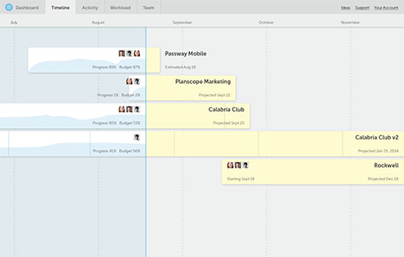

*This timeline for Planscope features sample projects at different stages of completion. Some of them “just started” or are “almost finished.” You can see text labels gracefully overflowing their designated space.*

## Dealing with real things
If you're a smart designer, then your mockups usually look super-polished. You use nice clipart images that you've carefully curated.

That's cool. But in the real app, things can get downright ugly.

Don't plan that image to be a pretty pic. Look at your own photo roll—the baby pics in the low light, restaurant receipts, that armchair that really caught your eye in IKEA, the scratch on your bumper.

Your app content is never going to be perfect, either. But it's fine so long as you come prepared and embrace all the peculiarities of real life.

Imagine a designer purse stuffed with potatoes. If you knew ahead of time you'd be carrying potatoes, I bet you'd have chosen a more comfortable backpack.

You should be designing around your content in the same way.

Here's what you can do to prepare for these real-life situations:

* If possible, unify the aspect ratio—at least for image previews. Twitter does this.
* Add frames, subtle or obvious, around each image
* Try using various geometric shapes for profile pics and similar images. Don’t just use squares, but circles or more exotic shapes.
* Prepare for images that have a white or transparent background. A border helps here.
* Add well-designed captions and decorate them with a simple icon for visual interest
* Add overlay areas like a gradient or a rectangle of white/black color and 50–70% opacity, and display some stats over them
* For blog posts: enlarge the image, blur or darken it, and use it as a full-bleed hero background

## The flow of content
As we look on the screen, it seems like we're always so limited with the device size. There's just one direction we can go without looking back. We can use the scroll mechanism to display as much content as we'd like.

A list view is critical to almost any app. Make sure you put a lot of thought into it, and maybe test a few different options.

Here are some tips:

* If our goal is not reading, but skimming through elements, then don't make the content elements too large—aim for a smooth scrolling rhythm when you have at least 3-5 rows visible at once
* Make sure you delimit the boundaries between the elements by using cards, dividers, or white space

The free content flow is interrupted by *pagination*.

Pagination, by definition, is a method of splitting content into edible pieces that fit into the screen height.

There's nothing particularly bad about pagination, but make sure it doesn't look ridiculous with a large amount of content. If you have hundreds of pages to look through, then you need to introduce some kind of filtering or structuring to your content.

## Designing lists and cards
Often we deal with cards that represent separate data entries, like people in an address book, or products in a store. Here's how to design the most usable content cards:

* Select just a few key parameters that are essential to display. Everything else can be shown in the detailed view.
* If the cards include images, make them as large as possible
* Make sure the card name is easy-to-readAccount for cards with really long names
* Select 1 key numeral like price and make it much larger—this works especially well with products in a store
* Don't make cards any longer than 1:2 ratio or they’ll be tough to scroll through
* To save vertical space, display some data over an image using an overlay stripe
* Don't rely too much on the hover effects, as they don't work for touch devices

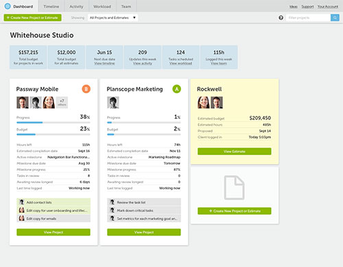

*For the agency dashboard in Planscope we opted for very detailed cards to give the agency owner a bird’s eye view of all his projects.*

## The book metaphor
As you might have already guessed, the heritage of physical books has been long dominating the UI industry. Even today, when the time comes to design a true reading experience, we often end up with pages and 1-screen slides. 5 or 10 years ago, the desire to include page-turn into the UX was simply unbeatable.

Why is it not desirable? You’ll be surprised how hard it is to divide a solid chunk of text that’s enriched with images and media into readable, pretty-looking pages.

Many natural obstacles like large images, headlines, sidenotes, and embeddable videos can make this a huge problem. They create an endless amount of combinations, none of which usually fit into the designated vertical space.

## The importance of typography
The interface consists of, and is crafted with, words. The way we treat them, the way we set type and organize paragraphs, is crucial.

Why is typography important?

* It ensures readability and flawless communication
* It communicates character and quality
* It helps bring consistency
* It helps to build contrast and visual interest

Let's see how we can achieve all these goals.

## Aim for comfortable reading
Make sure everything is readable. **Don't shy away from classic combinations, like black text against white background** — they're considered a classic for a reason.

When working with a body of text, you'd want to set the lines for the best readability. A comfortable line length is around 70 symbols per line, and the minimum is about 45 symbols for mobile devices. So even if you're working with wider screens, keep the text column narrow enough for comfortable reading.

Also, don't neglect the **white space** — the breathing space that surrounds the text both outside and between the lines. Make the line spacing 120–150%, and you'll notice the difference.

We set out to design the Airstory app with a strong focus on typography. Even though the user’s workspace is always a scarce resource, each card still has a significant white margin. This way everything looks much cleaner.

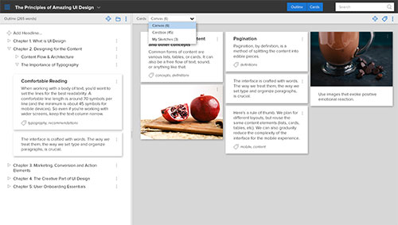

The “**distraction-free**” writing mode in Airstory also features generous white margins, while the main column remains rather narrow—around 70 symbols per line, as recommended.

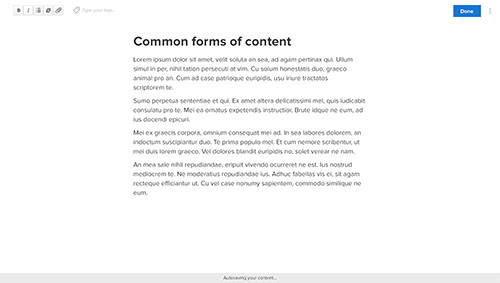

## General typesetting recommendations

* Be consistent and restrictive in your choice of fonts. For a single layout, don't pick more than 2 typefaces.
* Being conservative is better than being wildly creative. Decorative fonts have too much character, and they can affect readability. Use the classic typographic proportion: something around 3:4, which is how headlines of various levels relate to each other.
* Small fonts in contrast with relatively large body copy look interesting

## How to make the text look interesting
Here are the things that break the monotonous flow of a long text. Design for them, account for them, and use them in your content.

* Dramatic bold headlines
* Small font metadata
* Catchy intro paragraphs
* Subheads
* Lists
* Quotes and sidenotes

Quotes and sidenotes, for instance, can be accompanied by headshots or icons. They dramatically build interest along the way.

## Copywriting vs. typography
Here's the difference between copywriting and typography: **copy relates to what is written, and typography relates to how it's written**.

Both are extremely important in UI design. Copywriting isn't precisely a design discipline, but it's important for you to learn the basics of commercial copywriting and apply them in your job. This will help you build effective interfaces, plus it’ll increase your own value as a business consultant.

## Learn to write microcopy
Copywriting within a UI is not just large bodies of copy. Often it boils down to **microcopy** — text labels or short paragraphs that inform and direct a user as they’re performing a task. By microcopy, we mean navigation, headlines, button copy, and any other text comments that occur in the interface.

Done right, microcopy often goes unnoticed. Neglected, it can do a lot of harm—misspellings usually indicate the lack of quality for entire app, and confusing text labels do a poor job at guiding the user.

In a perfect world, you'll have an editor or a copywriter to tweak these for you. In the real world, you have to think of all the UI components, microcopy included.

Here are some microcopy tips:

* Double-check spelling
* Use actionable verbs instead of nouns to denote what's going to happen. *“View all projects in the library”* is much more informative than *“All projects”* — it denotes an action and tells the user where they’ll go after they click.
* Use conventional words that are commonly used for these tasks. *“Continue”* works better than *“Onward”*

We're striving for the same principle of clarity as we discussed before. The text should be legible, the links should be actionable, and everything should be conventional. Once again, obvious trumps clever.

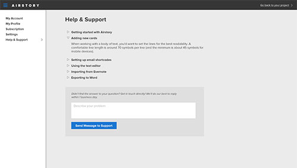

*This help screen in Airstory is one of those hard-working horse pages that rarely makes it to the showcase. However, they’re not that easy to design. You need to make a bulk of purely informative text look interesting. We’re splitting it in collapsible sections with bold headlines. Also notice the microcopy surrounding the form.*

## Responsive design
It's no secret that we have to constantly deal with a plethora of various devices, both mobile and desktop. My head starts spinning when I imagine the variety: desktop computers with huge monitors (some with Retina display), smaller laptops with restricted vertical space (both Retina and not), larger tablets, smaller tablets, phones larger than tablets, smaller phones, and much smaller outdated phones.

Crafting a design for each of the displays is impossible and unnecessary. For years, we've been operating the term “responsive design,” which essentially means that a layout can dynamically adjust to almost any size.

Responsive design has been out for many years, and we've already developed plenty of best practices for websites. But when it comes to scaling web apps, each app remains an individual challenge.

The term responsive usually applies to things viewed in the browser, particularly to website and web applications. But the following principles will also help you if you're downscaling an existing interface to a native mobile app as well.

## Do we design different layouts or resize the same one?
Responsiveness goes much smoother with websites, where the text content is just smoothly reflowed into a single column as opposed to a multi-column layout. All parallel elements are shown one by one without any loss of functionality.

With web apps it's much more intricate. Designers often get creative with screen layouts, which can be hard to simplify and transform into a mobile interface.

Here's a rule of thumb: **plan for different layouts, but reuse the same content elements like lists, cards, and tables**. We can also gradually reduce the complexity of the interface for the mobile experience perhaps by omitting non-critical data or controls.

Here’s a fragment of responsive wireframes that we used with Egghead.io. You can see how the same content is restructured and reused—no need for multiple high-fidelity layouts.

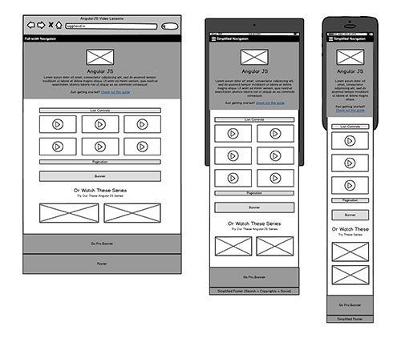

## Dealing with breakpoints
Responsive layouts are fluid layouts that change their behavior at **breakpoints**, which are screen width ranges that relate to different device types. Common breakpoints include *mobile/desktop* or *mobile/tablet/desktop* ranges.

Logically, breakpoints should relate to common device screen sizes. But try thinking about it differently. There are no common sizes, so breakpoints define the points at which your layout actually *breaks* — the lines become too long or short for comfortable reading, or the grid layout starts looking weird.

## Offering a separate mobile version
For complex apps it makes sense to completely rethink the UI for smaller screens. Oftentimes, we hide the editing functionality and leave the user with a more generalized, accessible preview (read-only mode). However, I highly recommend you leave the link to the full version somewhere in the bottom of the screen—there might be many life situations when editing functionality is crucial.

Imagine a situation where you need to update some accounting numbers while you’re on a trip, but there's no desktop computer within a 20-mile radius.

Being a UI designer myself, oftentimes I still get mad at developers when they limit the functionality in the mobile version of a web app. So please be careful and consider the user's interest first.

With Airstory, the founders decided to limit the scope of the app to a single input screen that would allow authors to capture their ideas on the go. Anything else, including viewing the projects and editing them, was left exclusively for the full-width desktop version.

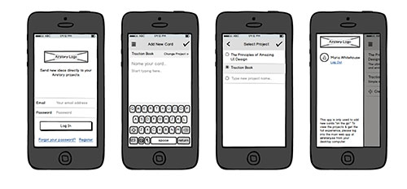

## Dealing with large amounts of data
Table views, especially ones with complex data, are among the hardest to handle. There's virtually no direct way to display long rows of data on a narrow mobile screen.

How do we solve this problem? We can shrink tables into rich lists, perhaps omitting certain data. Or we could use cards.

Cards turn up especially handy when it comes to fluid layouts: they fit essentially every screen and can be re-aligned to fill any available space. This allows for consistent data architecture in all versions of the app.

Here’s how we solved a complex data table problem in Gymsales app. For the mobile version, we stripped the table to the core and displayed additional data when an entry was tapped.

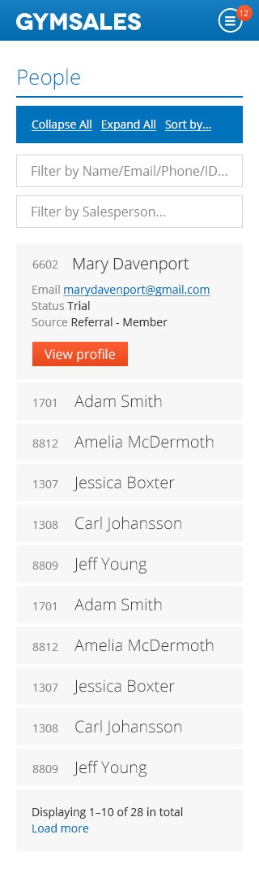

## Are tablets considered a mobile or desktop experience?
Without any doubt, tablets are classified as a mobile experience, but they certainly don't classify as smartphones.

**You should consider all possible use cases for tablets**: they're not held in hands, they're more often placed on a surface, and they’re even supplied with an external keyboard. In fact, I'm using one as I'm writing this chapter on my iPad.

Phones are typically handled on the go and don't correlate with any serious business activity.

More often than not, the layouts are still rather crowded, and developers use phone designs to be shown on iPads. This is irritating.

Here's an interesting opinion by Jonathan Stark, a mobile strategy consultant. He recommends treating desktop computers as tablets:

“I’d recommend treating smaller touchscreen devices in their own way, large touchscreen devices in their own way, and desktop devices the same as large touchscreen devices.

My reasoning for this is that there’s no good way to determine whether a device has a mouse or keyboard attached; so from a usability standpoint it’s better to err on the side of touch.” – Jonathan Stark

Ideally, your original desktop app should be simple enough to function well at the size of 1024px. This usually means leaving plenty of white space in the menus and making the app generally simple. Both are undeniably good for any interface.

## Navigation and controls
To an amateur, it may seem that UI design is all about sketching up a few navigation menus. But so much effort and thinking goes into this process.

## Main layout principles

* Opt for an open feeling whenever possible
* With menus and lists, don't fill all the available space—always leave at least 1/3 unoccupied
* Keep the lists healthy in size: 3-6 options can be enough, and anything else can be sub-structured
* Keep in mind that functions and requirements can change any time, and your layout should still work

The last principle has given me a lot of headaches in the past: new management requests were almost always breaking my layouts, making me think of new solutions. In fact, my designs just lacked scalability.

## Planning the screen layout
So here's your blank canvas. Before stuffing menus and navigation bars in all corners, think twice. Here's some advice:

* Don't crowd your screens with bars on all sides. Preferably use the top and the left parts of the screen, and keep everything else empty. Remember that open feeling principle?
* Be cautious about adding a bottom bar, especially if you have a top menu in place—the vertical space is a very limited resource, especially in web apps
* Be especially cautious developing workspaces that are broken down vertically into several static areas. It's hard to plan their behavior in smaller screens
* Don't forget about scrollbars
* **Design with a variety of content in mind.** Make sure your semi-transparent menus are clearly visible with cluttered random content beneath them—not just your perfectly blurred sample image.
* Indicate the most common action in the app and try to make it accessible with a single click

## Keep the navigation conventional
People love familiar layouts and familiar navigation patterns. They consider them beautiful and simple. They make them feel at home.

Why disappoint them? Here are some conventional elements you can always use:

* Logo in the top left corner
* Profile pic and account settings in the top right corner
* Navigation bar on top
* Search bar somewhere close to the top right, or in a more obvious place
* Main menu sliding from the left

Here’s how we simplified the initial workspace layout in Airstory. This is what the concept looked like during the first wireframing session. Check out how comments come into play when you’re dealing with UX.

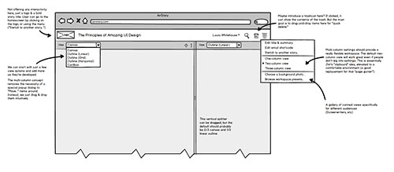

And here’s how it ended up. Everything was hidden in a left-side menu. All the key elements are placed on the top/left sides of the UI, leaving the rest open for resizing, scroll bars, etc.

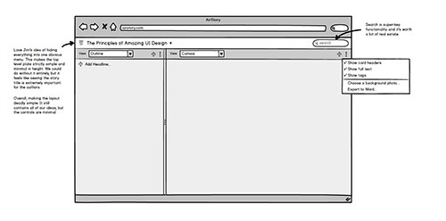

## Icons and text labels

**Icons can be as wonderful as they can be deceptive.**

What are the benefits? Icons save space and add visual interest to the interface.

And the pros? It's often hard to pick the right icon to represent certain action, and we end up with something pretty but not so obvious.

A good rule: **whenever you’re in doubt about an icon, omit it and use a text label**.

In complex systems, my go-to option is to use a couple obvious icons for quick access, like search, add, edit, and delete, and hide all the other options in a dropdown menu. This gives you full freedom in naming weird options as full as you'd like. For example, “Download as CSV...”

Generally speaking, words work better than icons, but you have to pick the right words. Use verbs for actions whenever possible, and make sure your text labels are easy to understand and common. Save, continue, and done are all good examples.

## Where am I?
The foundation of usability: the user's confidence. Even if someone has no clue about the content (they’ll learn that later), they should at least know where they are.

* Use headlines that match and refine navigation labels
* In complex systems, use breadcrumbs to show a few levels of navigation
* For text links, make sure you tell people where they're going. “Go to Settings to edit email preferences” works much better than “Edit your email preferences here.”
* Give the user a clear option to go back—don't rely on the browser button

For screens that suggest editing some content, make sure there's a huge “Save” option available so no content is lost. But don't forget about the “Cancel” option for those especially cautious users who don't want to change anything unless they explore the app.

Google Drive does a great job showing the user’s current location in their prominent breadcrumb area. This is crucial for any app that deals with files and folders.

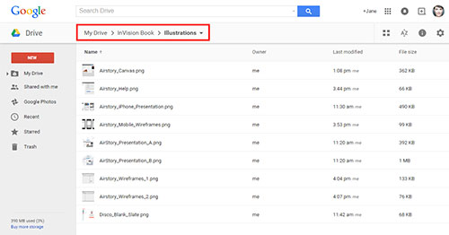

In chapter 3, we'll cover sales and marketing 101, and how to drive behavior with visual clues.