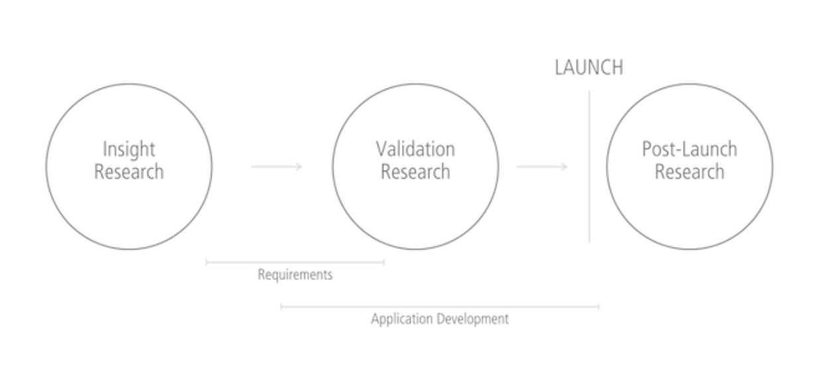

# What is user research?

User research is the act of interviewing prospective and actual users of your products to gain clarity on a number of objectives. You might use it to figure out why people aren’t adding recommended products to a cart, why they’re not clicking through your emails on mobile phone, or why adoption of your application has fallen significantly.

You may also be developing a new product or redesigning a website and know you want to do it differently this time around. All of these are great reasons to let your users tell you how they feel about your product.

**Conducting user research is just one part of the equation.** Afterwards, you have to act on that feedback to make new product decisions or enhancements. Depending on your role in the project, you may not agree with some of the feedback. If this is the case, **remember that you’re not the end user**. Your day is likely consumed with interacting with the website or application, which isn’t representative of a typical user’s usage.

Check your ego and accept that changes need to be made. It’s not bad—it just is.

The information in the remainder of this chapter will give you a glimpse into the basics of user research and testing. Though it’s not an in-depth how-to on conducting user research, it’ll give you broad insight into the types of user research methods so you can incorporate user research into your project timelines.

## Research-driven product model
The goal should be to engage users to drive business and digital product decisions and strategy. You shouldn’t wait to engage them post-launch in a reactive, defensive mode when adoption is low, abandon rates are high, and revenue is disappearing.

Buy why? Business has been conducted this way for decades. Companies tell users and consumers why they need to buy their product. They’ve been told what they should eat, what car they should buy, and even which deodorant to use.

**Companies should have conversations with their consumers and users.** The advent of Internet reviews and social media word-of-mouth has radically upended this one-directional conversation. There are countless case studies about various brands’ poor responses to reviews and failed grassroots social media efforts.

Users are merciless when it comes to telling their friends and networks about a subpar product or service. There’s immense power in that, and you can harness this through proactive, positive user research to avoid potential disasters later.

What does this look like, and how is it done? Reach out early, ask often, and always listen. **UX isn’t UX without research**, after all.

The model above illustrates both a research-driven product approach layered on top of a very simplified product development model. It can be as simple as inserting insight research prior to making any business or product decisions.

What do your users think of the current product? What features do they think are missing? Would they change anything? Conducting these interviews and subsequently creating personas—which we’ll talk about in the next chapter—helps ensure you’re harnessing user feedback in the best possible way.

## Types of user research methods
The following research methods outline 5 different methods for starting those conversations. This list isn’t meant to be exhaustive—it’ll cover the basics.

Before we jump in, let’s define a few terms:

* Facilitator: user research professional who plans and executes the research, gathers feedback, and reports all of that back to the project team
* Participant: a user who’s part of the research process
* Recruiting: the act of locating your product’s users to conduct a research test
* Compensation: users are usually compensated for their time as a participant
* Usability lab: a traditional lab where tests are conducted. There are typically 2 rooms separated by a 2-way mirror for observation purposes.

## User interviews
**User interviews are the keystone of user research**, grounding all additional approaches, methodologies, and deliverables in the act of conducting an actual conversation with your users. They can take place in traditional usability labs, remote via phone or web-based video, or the place in which your users typically engage with your digital product. This could be an airport, retail store, personal home, or a medical clinic, to name some examples.

Interviews can range from multi-week planned events to guerrilla-style interviews based on just minutes or hours of planning. This flexibility is key depending on the UX maturity of your organization and the funding available.

## Usability test
A usability test is conducted to validate an in-progress concept or a live product currently being used, or to drive UX changes after analytics and feedback indicate a usability problem. This research can take place in a traditional usability lab or on-location as part of a contextual inquiry.

A standard usability test involves specific tasks and will usually be tightly scripted in order to pinpoint specific issues. Facilitators can follow up with probing questions to dive into more detail. Participants will be encouraged to “think aloud” as they describe their thoughts about navigating through the tasks. Feedback tends to be more accurate and relevant because users are asked to state the first thing that pops into their head. Allowing participants to revert or think deeply about their responses can allow them to edit their response. That skews feedback.

## Contextual inquiry
A contextual inquiry is conducted to understand how users interact with a product, or a prototype of a new product, in the exact setting it’ll be used. So it likely won’t happen in a usability lab. Locations can range from participants’ homes, retail environments, airports or train stations, classrooms, medical offices, and more. This type of research can involve more planning and perhaps a higher cost due to the variations on recruiting and compensation.

A contextual inquiry can also be a usability test with the added research including how different settings change users’ perceptions and feedback.

Imagine you’re testing a point-of-sale system. Feedback could vary greatly depending on whether it’s being used in the aisle of a retail location versus at a hot, crowded summer festival.

Depending on the type of feedback desired, the facilitator can simply observe users taking notes on the entire application. Or specific tasks can be defined to gain specific clarity. If the latter is employed, additional research may be required to follow up on specific tasks.

## User experience competitive user analysis
A user experience competitive analysis is conducted to understand how your users are also using your competitors’ products. If the product you’re launching will be part of a crowded field, use your competitors’ websites and applications to learn what works and what doesn’t. Learning from these users and identifying mental models will help you capitalize on things done well and avoid potentially fatal mistakes.

A UX competitive analysis differs from more traditional competitive analysis that’s rooted solely in documenting data such as competitor offerings, market share, and strategy.

## Heuristic and expert analysis evaluation
A heuristic or expert analysis is conducted to evaluate a website or application against agreed upon design principles. User research and user experience professionals evaluate the system and gather issues. Those issues are then classified to what principle it violates and are assigned criticality to give direction to the team.

Because these types of research activities don’t typically involve users, they can be conducted when there’s no budget available to recruit users for a larger-scale test. Even though users aren’t always engaged, it’s best to have researchers who are familiar with your users conduct these evaluations so they can focus on known issue areas. Additionally, typically a group of 2-3 professionals conduct the analysis to ensure as many issues as possible are uncovered.

A heuristic can also be used as a precursor to almost any other methodology, meaning that by evaluating a system to find usability problems you can inform interviews, usability tests, and more.

## Additional methods
There are a number of additional types of research that can be employed depending on the need and maturity of your organization:

* A/B testing
* Surveys (in-person, email, web based, etc.)
* Click analysis
* Eye tracking
* Diary studies
* Focus groups
* Task time studies

## Types of user research deliverables
These deliverables focus on what the business team can expect from a research resource.

## Test plan
The test plan represents the culmination of planning for your research effort. The gathering of this information should be collaborative and involve interviews with stakeholders and subject matter experts.

Collaboration isn’t absent from this process. All parties should have ample time to review the document to ensure they’re comfortable with the approach.

* Objectives: What do you want out of the research effort?
* Methodology: How are you going to gather insight?
* Participants: Who are you gathering insight from?
* Outline: What will the flow of the session be?
* Test environment: Where will the research will take place?
* Project schedule: When can you expect the research to take place, when will initial results be available, and when will the full report be delivered?

## Findings report
After the research effort is complete, a research findings report should be delivered to synthesize and report common insights. Types of documents delivered will depend on the methodology used, but you can expect a document that contains data, quotes, photos, videos, and enhancement recommendations.

As a follow-up to the test plan, all items listed above should be included to ensure everyone on the team is aware of how this feedback was gathered.

## Takeaways
* UX isn’t UX without user research
* Insight research should be conducted prior to product decisions being made
* There are a variety of research approaches based on what’s needed