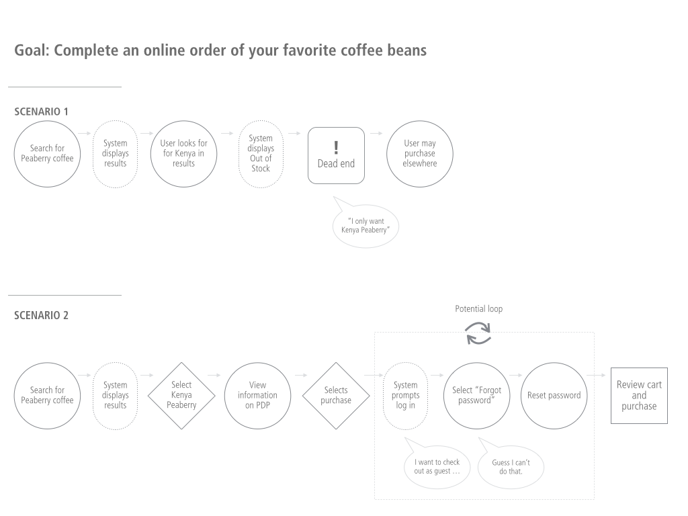
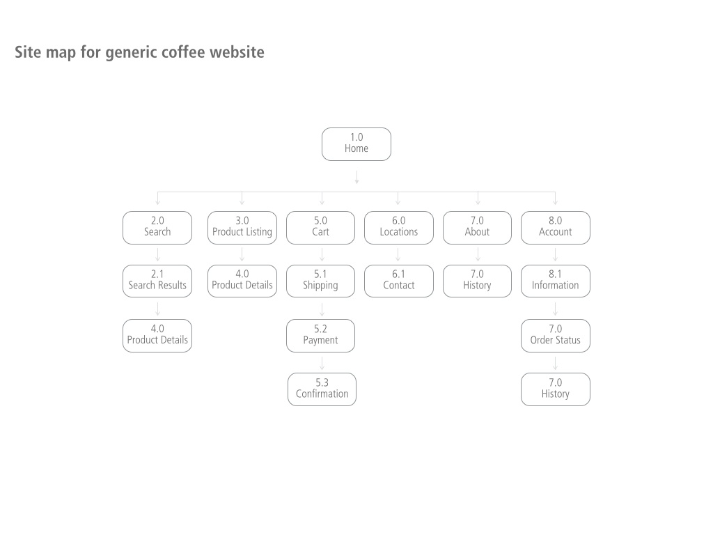

# What is Information architecture?

For the purpose of our conversation, and because it aligns with my mental model, I’m choosing to broadly define the role of information architecture (IA) to include the development of site maps, user and task flows, wireframes, annotations and prototypes.

Your mental model may differ, and that’s fine.

As a reprise from chapter 2: there are numerous roles and titles in the UX world, and **we need to focus on creating work that positively impacts users’ lives** — regardless of who completes it.

It seems too simple to say that **information architects organize and simplify an experience**, but it’s accurate. They apply a number of organizational tactics to ensure that everything from the navigation (site maps and taxonomy) to the organizational structure (wireframes) of the page makes sense.

The rest of this chapter will provide outlines of these various deliverables and how they’ll improve digital product creation.

## User/journey flows
User and journey flows visually depict steps, actions, decisions, and other elements of a product to communicate how users will interact with it to achieve a goal. These documents are typically created early in the project but should be audited and curated throughout the project to ensure they’re up to date. User/journey flows are typically rooted in personas. After all, each persona has different goals to achieve and will likely navigate the experience differently.  

There are several types of flows/journeys that can be created:

* **Current state**: a flow/journey can be retroactively created for an existing product to understand whether it’s easy to navigate, or if opportunities are present. This activity is especially useful if you’re trying to recommend a redesign or if there are known usability issues. It’s even more beneficial if financial information is available to indicate how much potential revenue is lost if there are problems in the flow.
* **Future state**: a flow/journey is equally useful as a proactive tool, especially when created early in the project lifecycle. They can be used to visualize strategy decisions or requirements that have already been approved.
* **Ideal state**: If current and future state flows still require changes to make the experience more user-centric, create a document that outlines the ideal in order to build consensus towards implementing those changes. Whenever possible, use direct user feedback to support recommendations.

A flow/journey includes a number of elements:

* **User goal(s) and expectation(s)**: this information should be applied from user personas to ensure the flow is aligned with their mental models
* **Thoughts/attitudes**: this information can be applied from user personas, or it can be gathered through individual user interviews. What’s the user thinking when they’re moving through the flow? Are they annoyed they have to sign in again? Are they pleased that the checkout button is sticky and available without scrolling? This information should be rooted in actual user feedback and shouldn’t be made up. Ideally, it’s rooted in actual user quotes.
* **User action**: an indicator that describes what the user must do to move onto the next step or complete a discrete action. For example, the user selects “cart” from main menu.
* **User decision**: an indicator that describes a decision required to move onto the next step, such as “The user must select ‘submit’ before purchasing the cart.”
* **User loop**: an indicator that alerts that the flow of the website or application can potentially create a negative user loop. A loop is a part of the flow that users cannot easily get out of and can be tied to high abandon rates it isn’t addressed.
* **Dead end**: an indicator that describes when a certain path or flow is a hard stop for the user. These types of experiences should be highly evaluated and researched to ensure the product minimizes the number of dead-ends. Sometimes they’ll be unavoidable—but only in extreme circumstances.
* **Completion**: an indicator that defines the flow or journey is complete. For example, the cart is purchased and confirmed. The completion step shouldn’t be a dead-end.

## Site maps
A site map is a visual model of the pages of your website or application. These documents are used to logically group similar information in a hierarchical structure to ensure content is placed where users expect to find it. User research and mental models can be applied to help arrive at this structure.

IA resources creating the site map may engage other project resources and users to participate in a card sorting exercise to help them logically group content. This exercise involves each individual working with cards or sticky notes to group and structure information as they see it best. The facilitator will then audit all sorts and test different map options.

As project teams collaborate through site map creation, constantly refer back to your personas. Will each persona follow the structure? Will they agree with the groupings and naming conventions?

A site map defines:

* Hierarchy of the content on a website or application
* Navigation structure including primary, secondary, and tertiary navigation structures
* Main menu and nested menu items with corresponding classification numbers to track all aspects of product development

A sitemap is useful as an early deliverable in the project lifecycle to bring clarity to the scope of work and provide direction to all resources.

## Task flows
Task flows outline the full system interaction. They’re inclusive of every step the user must take to complete a task, along with the IT systems required to send information and content to make the product function. It further captures all possible input and response scenarios to ensure everything is accounted for and a UX treatment is applied.

A UX task flow isn’t meant to replace IT architecture documentation, but to be created alongside it. **UX and IT are completely reliant on each other to make a product come to life**, and these documents help outline how user goals and expectations drive IT strategy decisions. Collaboration doesn’t stop outside of the circle of product owners and UX resources.  

A flow/journey will include a number of elements:

* **Service integration points**: when specific services will be called to complete user actions. For example, a user wants to upgrade their car insurance, so what orchestration needs to occur on the backend to check eligibility and options? (Are multiple services being called? How long will it take to get a response? Is there an opportunity to consolidate service calls to improve response time? How are these communicated to the user?)
* **Server response scenarios**: this defines all of the possible responses based on user task input. For example, a user is searching for new cable and internet service on an aggregator website. What happens when they put in the wrong address? What happens when only 2 of 5 providers offer service? What happens if they already have service and are only available for upgrades?
* **Service failure scenarios**: what happens when services are down and cannot send a response? Are users able to retry the service or at least go somewhere else in the experience? If a service goes down, is it a dead end? Example: an e-commerce product detail page may likely call several different services. If the image and video service is down, is access to the page shut off, or can users still add products to the cart?

These documents are incredibly important to the product development process. It’s fun to create wireframe concepts and review visual design options. For most, it’s less fun to audit error scenarios and create a meaningful path to recovery when something goes wrong.

However, that’s precisely where time investment is needed. **Frustrated, annoyed users are likely to jump ship to a functional website.** Revenue just went elsewhere. The maturity, success, and elegance of an application is rooted in handling all scenarios, not just the easy ones.

## Wireframes
Wireframes depict the visual organization of an experience, define front-end functionality recommendations, convey content needs, and work through information hierarchy. They’re typically gray scale and don’t define visual design elements. As noted in chapter 2, it’s typical that project teams may want to jump immediately to wireframes. But this should be avoided at all costs. Without conducting insight research, understanding mental models, and creating personas, flows, and site maps, the product isn’t likely to be user-centric. Again, this perpetuates the UX in a silo mentality.

Creating wireframes ahead of visual design is key to iterating through experience concepts. Because wireframes are created in grayscale, it allows project teams to focus on content, hierarchy, and functionality rather than colors, type choices, and images.

As cliche as it may be, when building a house you start with the wiring, plumbing, and HVAC before you hang the window treatments. You don't want to have a beautiful house where the toilets aren't hooked up to plumbing.

Wireframes define the following elements:

* **Organizational structure**: how the overall product will be structured; where navigation is located, headlines, body copy, images, buttons, footer, etc.
* **Navigation**: how the navigation outlined in site map creation will appear in the product. If the website or application is large there will likely be a complex navigation structure that will require integration and testing.
* **Content hierarchy**: working with the site map and content strategy deliverables, an IA will define a hierarchy approach to content based on the needs of each user persona. Let’s say there are 4 content elements on a page (header, intro paragraph, body copy, and a bullet list), this information isn’t of equal importance. Through type-size differentiation (large type versus small type), wireframes will define hierarchy to ensure users find what’s of most importance to them quickly.
* **Functionality**: wireframes provide direction and recommendations on front-end technologies to IT development partners, like if creating wireframes for a mobile application and flicking right is supposed to animate the menu open. This portion of wireframes needs to be defined in conjunction with front-end developers through collaborative research and discussion.
* **Annotations**: a general tool to provide direction to other project teams. They can include any or all of the following specifications:
* **Business requirements**: requirements can be included in wireframes to connect them to the experience.
* **Functionality**: can be included to provide specific direction to developers. Including examples of specific requirements will help ensure the final experience matches expectations.
* **UX requirements**: can be included to enhance the experience. For example, if user research has determined validating form field inputs as the user types is better than validating on submit, include that as a UX specific requirement.

## Sketching
The art of sketching is central to almost every UX professional. This is born out of the need to iterate through numerous concepts and to quickly document ideas for further fleshing out later. There is also less commitment than jumping right to a computer-based solution.

**When sketching, don’t focus on perfection.** This isn’t a graded art school effort—it’s more important to get a number of ideas documented rather than focus on detailed drawing. Gathering a wide variety of sketch tools is important, too: various sizes and colors of markers, pens, and paper or whiteboard. If using paper, a standard 8.5x11 paper is roughly the size of a large monitor. Fold it in 2 for smaller devices, or 4 for smaller phones. There is no need to get more fussy than that. Exact dimensions aren’t vital.

Paper or whiteboard sketching:

* **Co-sketching**: a technique that a UX professional may use with other project resources or even users themselves. If you’re in a client-focused company, facilitating co-sketching sessions with clients can help build ownership in the final idea and may reduce revision rounds.
* **Whiteboard sketching**: the same approach as paper, but on a whiteboard. Effective in a larger, corporate environment—they’re in every meeting room, on almost every wall. If you find yourself in a room of people talking through various solutions with no resolution in sight, get to the whiteboard and start sketching ideas. Encourage others to do the same. Whiteboards also offer a very quick ramp-up time, removing the need for paper.
* **Quick-sketching collaboration**: time-boxing a sketching session can be an effective way to work through a particularly challenging UX issue. A 15-minute structure works well with 5 minutes for setup and overviewing the challenge, 5 minutes for silent individual sketching, and 10 minutes for presentations of each approach. This exercise works best with small groups of 3-5 individuals to be sure there is time to present concepts.

## Prototyping
Creating prototypes of websites or applications is important to allow user research and project stakeholders to navigate wireframes in a similar format to the final experience. In the not-so-recent past, it wasn't atypical to receive a multiple-page PDF of wireframe screens. Scrolling through the various screens while “talking” through the interactions wasn’t very compelling—and it was far removed from how users will navigate the experience.

The remainder of this chapter will walk through various approaches to delivering a more compelling wireframe experience.

## Paper prototyping
Paper prototyping is similar to sketching in that pages of the website or application are drawn on various sheets of paper. You can elevate paper prototyping from quick sketching to facilitate more focused collaborations on specifics part of the experience.

***Hierarchy through paper color***

* Different colors of paper can be used to convey different actions or sections of the experience. For instance, a hot pink sticky note can be used to convey the main call-to-action on a screen so participants can work through placement and hierarchy.

***Simulated animations***

* By drawing different parts of the experience on loose pieces of paper, you can simulate animations early in the process to gain buy-in
* **Slide menus**: draw one on a separate piece of paper to explore how it should animate in
* **Modals**: as rudimentary as it sounds, placing a piece of paper on top of a larger screen can be very effective to determine if a modal is the appropriate approach

## Click prototyping
Click prototyping is creating simple click-through flows of an experience, providing a more realistic view of what the final experience will be. This functionality is built into most wireframe tools and is also widely available through other applications. With a few minutes of work, you can deliver a differentiated wireframe experience.

To illustrate, if you’re working on an ecommerce website, you can create a click-flow starting on the home page, through search and filtering, viewing a product detail page, adding an item to the cart, and checking out. There’s immediate benefit to this as opposed to scrolling through a PDF document.

Click prototyping is easy to implement, and its benefits far outweigh delivering a static document. This approach should be a basic expectation in almost every project.

## Advanced prototyping
Advanced prototyping is creating highly interactive and functionally realistic flows through incorporating animations, mathematics, logic, and more. Adding this level of detail helps set clear expectations of what’s expected in the final experience. Rather than annotate that a hidden menu should slide open, that animation can be incorporated and fully experienced. This removes the need to verbally explain the recommendation, which can leave it open to interpretation.

Advanced prototyping requires deep knowledge of prototyping software and won’t fit all project budgets and timelines. If you’re able to incorporate this deliverable into projects, it can help reduce incorrect interpretations for other project teams and facilitate a more meaningful user research process.

Ready for more? In the next chapter, we'll focus on the visual design of user interfaces.